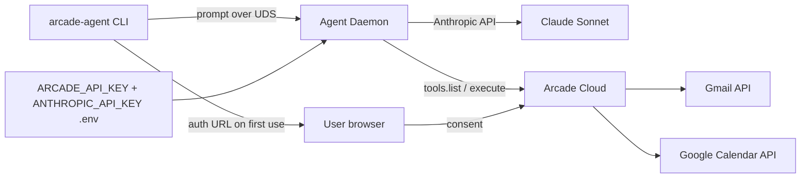

# arcade-agent

A portable demo Python agent that runs as a local background daemon and uses
[Arcade.dev](https://arcade.dev)'s hosted Gmail + Google Calendar tools, driven by
Anthropic Claude.

> **Status**: working demo. 106 tests passing, live probe verified against real Arcade,
> end-to-end run (consent → tool execution → response) confirmed.

## Why it exists

To prove out three things together:

1. **Anthropic Claude** doing native tool-use against
2. **Arcade-hosted Gmail + Calendar tools**, with
3. **Per-user Google OAuth handled entirely by Arcade** — no local Google OAuth client,
   no refresh tokens on disk, no OS keychain. The only local secret is your Arcade API
   key in `.env`.

## Quickstart

### One-line install

```bash
curl -fsSL https://raw.githubusercontent.com/takabayashi/arcade-agent/main/install.sh | bash
```

That script clones the repo to `~/arcade-agent`, installs [`uv`](https://docs.astral.sh/uv/) if you don't have it, creates a venv with all dependencies, and seeds `.env` from `.env.example`. It's safe to re-run — your `.env` is preserved.

To install somewhere else: append a path, e.g.
`... | bash -s -- ~/code/arcade-agent`.

Then:

```bash
cd ~/arcade-agent

# 1. Fill in your two keys in .env (one-time)
#      ARCADE_API_KEY    from https://api.arcade.dev/dashboard
#      ANTHROPIC_API_KEY from https://console.anthropic.com/settings/keys

# 2. First-run wizard (creates a binding, opens browser for Google consent via Arcade)
.venv/bin/arcade-agent init

# 3. Start the daemon and chat
.venv/bin/arcade-agent daemon start
.venv/bin/arcade-agent ask "list my last 3 emails"
.venv/bin/arcade-agent chat

# 4. When done
.venv/bin/arcade-agent daemon stop
```

### Manual install (if you don't want to pipe `curl` to `bash`)

Requires Python 3.11+ and [`uv`](https://docs.astral.sh/uv/) (or plain `pip`).

```bash
git clone https://github.com/takabayashi/arcade-agent.git
cd arcade-agent
uv venv && uv pip install -e ".[dev]"
cp .env.example .env  # then edit with your keys
```

## Architecture



- **CLI** (`arcade-agent`) talks to a **daemon** over a Unix domain socket
  (`~/.arcade-agent/agent.sock`, chmod 600). Newline-delimited JSON, no HTTP.
- **Daemon** runs an Anthropic Claude tool-use loop. Tools are pulled from Arcade Cloud
  via `arcadepy` (`Gmail.*`, `GoogleCalendar.*`). One process; in-memory per-session
  history.
- **Auth**: Arcade owns the Google OAuth app and stores refresh tokens server-side. The
  CLI surfaces consent URLs that you click through once per binding.
- **Bindings**: named `user_id` mappings in `~/.arcade-agent/bindings.toml`. Add as many
  Google accounts as you want; switch with `--binding NAME`.
- **Confirmation gate**: ON by default for destructive tools
  (`Gmail.SendEmail`, `GoogleCalendar.DeleteEvent`, `GoogleCalendar.UpdateEvent`). The
  CLI prompts y/N before they fire.

For the full design — including the architect's spec, QA defects report, and final
sign-off — see [`docs/`](docs/).

## Tool surface

Exposed to Claude on every prompt (13 tools, all from Arcade's catalog):

**Gmail**: `SendEmail`, `ListEmails`, `SearchThreads`, `GetThread`, `WriteDraftEmail`,
`ReplyToEmail`, `ListLabels`

**Google Calendar**: `ListEvents`, `CreateEvent`, `UpdateEvent`, `DeleteEvent`,
`FindTimeSlotsWhenEveryoneIsFree`, `ListCalendars`

Adjust [`src/arcade_agent/config.py`](src/arcade_agent/config.py) to add or remove tools
from the set.

## CLI reference

```
arcade-agent version             # print version
arcade-agent init                # first-run wizard

arcade-agent bind add NAME --user-id EMAIL
arcade-agent bind list
arcade-agent bind remove NAME
arcade-agent bind set-default NAME
arcade-agent bind reauth NAME

arcade-agent daemon start        # double-fork; logs to ~/.arcade-agent/daemon.log
arcade-agent daemon status
arcade-agent daemon stop

arcade-agent ask "..." [--binding NAME]
arcade-agent chat [--binding NAME]
```

## Project layout

```
src/arcade_agent/
  cli.py            Typer CLI
  config.py         paths + toolkit list + destructive set
  arcade_client.py  arcadepy wrapper (schema discovery, authorize, execute)
  bindings.py       name -> arcade user_id registry (TOML, 0o600)
  daemon.py         Unix-socket server + double-fork lifecycle
  claude_agent.py   Anthropic tool-use loop (async generator)
  confirm.py        confirmation-gate helpers
  errors.py         typed exceptions

scripts/
  probe.py          live smoke test (lists real Arcade tool schemas)

tests/              106 unit + integration tests (pytest-asyncio)

docs/
  IMPLEMENTATION_SPEC.md   architect's spec (1500+ lines)
  DEFECTS.md               QA's adversarial defects report
  SIGNOFF.md               architect's final sign-off
```

## Development

```bash
uv venv && uv pip install -e ".[dev]"

# Lint + format
.venv/bin/ruff check src tests scripts
.venv/bin/ruff format src tests scripts

# Tests (106 pass; one extra test runs live against Arcade when ARCADE_API_KEY is set)
.venv/bin/pytest -q

# Live probe (requires ARCADE_API_KEY in .env)
.venv/bin/python scripts/probe.py
```

CI runs `ruff check`, `ruff format --check`, and `pytest` on every push and PR — see
[`.github/workflows/ci.yml`](.github/workflows/ci.yml).

## Security model

- **No Google OAuth client locally.** Arcade owns the OAuth app; you consent once via
  Arcade's URL and your refresh tokens stay on Arcade's vault.
- **No keychain.** Only the Arcade API key is a local secret, and it lives in `.env`
  (gitignored).
- **No credentials cross the LLM.** Claude only sees tool schemas and sanitized results.
- **Daemon socket is localhost-only**: `AF_UNIX` with `chmod 600` — only the same OS
  user can connect.
- **Destructive ops are gated** by a confirmation prompt unless explicitly disabled.

## License

MIT — see [LICENSE](LICENSE).
